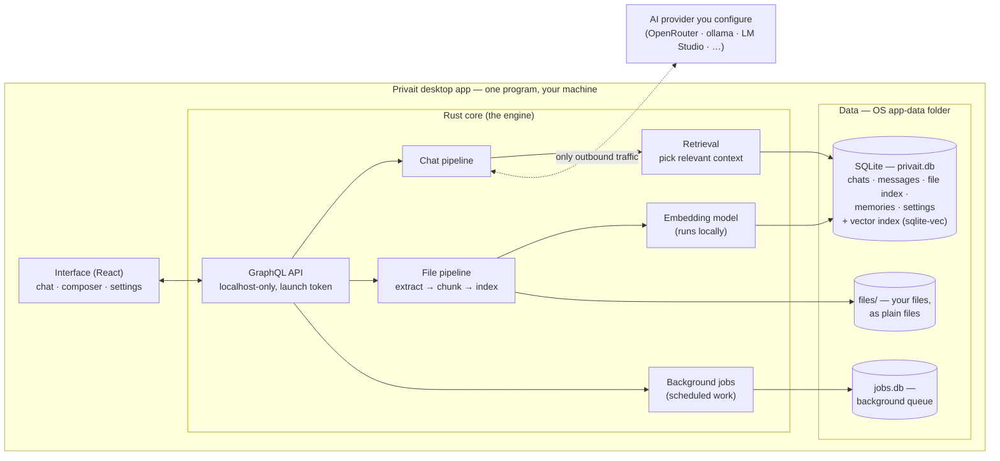
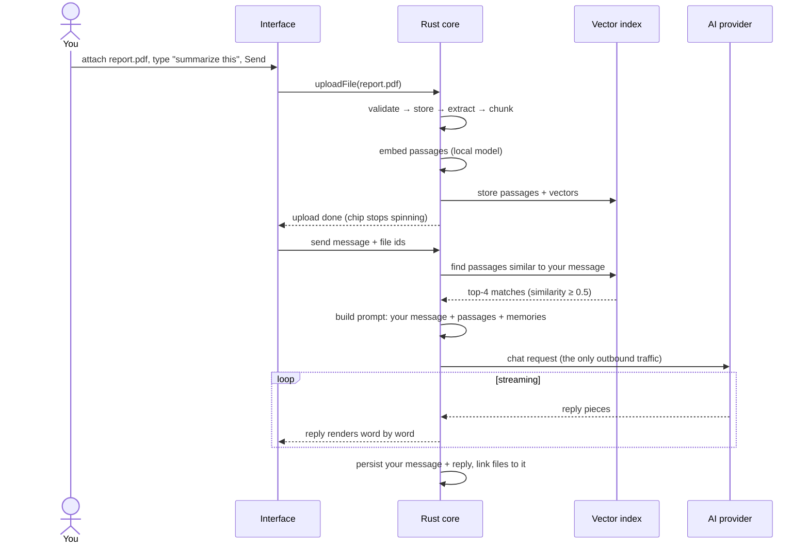

# Privait — Architecture

This document describes how Privait works: what the moving pieces are, how
data flows through them, and why key decisions were made. It is written to
be understood without reading the code.

For the mission and principles see [vision.md](vision.md); for where the
product is heading see [roadmap.md](roadmap.md).

## The big picture

Privait is a desktop app for chat, journaling, and reflection where an AI
grounded in your own writing helps you think — and nothing leaves your
machine unless you deliberately route a request to an AI provider you
configured yourself.

The whole product is one program running in one process on your computer:

- **A window** (the React interface) — where you write, chat, attach files,
  and change settings.
- **A Rust core** (the engine) — a small server living inside the app that
  does everything else: talks to the interface, stores data, runs the file
  and embedding pipelines, and streams replies from your chosen AI
  provider.
- **Local data** — a SQLite database, your files as plain files on disk,
  and a background job queue. All of it lives in the OS app-data folder.
  Delete the app and your words are still there.

The interface and the engine talk to each other over a private,
localhost-only API, so the two sides stay cleanly separated.

## System diagram

Everything inside the large box runs offline. The dashed line to the
provider is the app's only outbound network traffic, and it happens only
when you send a chat message.

## The pieces, one by one

### The interface (React)

The window you see. It renders chat threads with message history, a
composer with a paperclip button for attachments (shown as removable chips
while composing), a settings dialog, and theme toggle. It holds no state of
its own that matters — everything is persisted by the engine — so closing
the app mid-sentence loses nothing.

### The engine's API (GraphQL)

The interface sends requests and receives streamed replies over this
internal API. It binds only to `127.0.0.1` (your machine's loopback
address) and requires a random per-launch token that the engine hands to
the interface at startup, so no other program on your computer can talk to
it. Replies stream token-by-token over a WebSocket connection; pressing
stop-generation cancels the stream on the engine side.

### The chat pipeline

When you send a message, the engine:

1. Retrieves relevant context (see [Grounding](#grounding-how-the-ai-knows-what-you-wrote)).
2. Builds the request: your message plus the retrieved context.
3. Sends it to the configured AI provider and streams the reply back into
   the window, persisting both your message and the reply.

Which provider handles the request is entirely your choice, configured in
Settings (base URL, API key, model). Any OpenAI-compatible provider works:
cloud services with no-logging policies, or local servers like ollama, LM
Studio, or llama.cpp-server running on your own machine. A fully in-process
local model (no separate server) is planned before release.

### The file pipeline

Attach a file (PDF, TXT, CSV, MD, HTML — up to 5 MB) and the engine
processes it locally:

1. **Validate** — size and type checks; failures surface as a toast, the
   send aborts (no partial sends).
2. **Store** — the original file is saved, byte-for-byte, into a `files/`
   folder.
3. **Extract** — text is pulled out (PDFs via a Rust PDF extractor).
4. **Chunk** — the text is split into overlapping passages (512 tokens,
   64 overlap).
5. **Embed & index** — each passage is turned into a vector (see next
   section) and stored in the vector index, linked to the file.

All of this runs on your machine. Processing happens inline at upload time
(because you're already waiting on Send), and the one-time embedding-model
download on first ever upload shows up as a longer "processing" state on
the attachment chips, once.

### The embedding model (local)

Embeddings are how the app compares meaning. A small, fully local model
(bge-small-en-v1.5, 384 numbers per passage) converts each passage of your
files — and each memory — into a vector. To find what's relevant to your
question, the engine compares your question's vector against stored ones
(cosine similarity) and keeps the best matches. This never touches the
network: embeddings are computed locally from day one, because a
background pipeline quietly shipping your writing to a cloud embedding API
would violate "private by default".

### Grounding: how the AI knows what you wrote

Before each chat turn, the engine injects up to 8 pieces of context into
the request:

- **Top-4 file passages** — matched from files attached to _this_
  conversation. Grounding is per-chat: a file attached to one conversation
  never grounds another. Files link to the exact message that carried
  them, which is how attachment chips re-render after an app restart.
- **Top-4 Memories** — distilled long-term facts, global across chats.
  The Memories layer is inspectable and editable by design — no hidden
  profile.

A match must clear a similarity threshold (0.5) to be used. If nothing
matches, the turn proceeds ungrounded — silence is preferred over noise.

Two refinements make this feel natural:

- **Empty message + files**: if you attach files and send no text, the
  bubble shows only the chips; the model receives a synthesized
  "Please read the attached file(s) and respond." A file-only first
  message titles the thread from the file's name.
- **Orphan cleanup**: uploads that never made it into a message (a send
  aborted mid-upload) are deleted at next app start.

### The database (SQLite)

One SQLite file (`privait.db`) holds everything structured:

| Table           | Holds                                                        |
| --------------- | ------------------------------------------------------------ |
| `conversations` | chat threads (title, timestamps)                             |
| `messages`      | each message in each thread                                  |
| `files`         | attachment metadata, linked to the message that carried them |
| `file_chunks`   | passages cut from files, with their vectors                  |
| `memories`      | distilled long-term facts, with vectors                      |
| `settings`      | provider configuration (base URL, API key, model)            |

Vectors live in the same file via the sqlite-vec extension. There are no
user accounts — the app is single-user by design — and no soft deletes.

Background jobs use a **separate** `jobs.db` file managed by the apalis
queue library. Today it sits out of the upload path (uploads are inline);
it's kept for upcoming scheduled work, like weekly reviews in the Reflect
phase.

### Your files, as files

Original uploads are stored as plain, untouched files in a `files/` folder
(via the OpenDAL storage library). The database is only an index over them
— every vector and metadata row is rebuildable from the files themselves.
Storage behind OpenDAL also means a future cloud-backup/sync layer would
be a backend swap, not a rewrite.

## A chat turn with an attachment, end to end

## Privacy and security properties

- **No login, no accounts.** Single user, single device, local app.
- **No telemetry.** No analytics, no phone-home — verifiable against the
  open source (AGPL-3.0).
- **Private API.** The engine listens only on localhost and demands a
  random per-launch token; no other local process can reach it.
- **One outbound path.** The only network traffic is the chat request to
  the provider you configured, and you can point it at your own machine.
- **Local embeddings.** The background pipeline never calls out to the
  network.
- **Exportable data.** Notes/files are plain Markdown/files on disk; the
  database is rebuildable from them.

## Design decisions and why

| Decision                                             | Why                                                                                                                                                                                                                                           |
| ---------------------------------------------------- | --------------------------------------------------------------------------------------------------------------------------------------------------------------------------------------------------------------------------------------------- |
| Keep the GraphQL API between UI and engine           | The React data layer (Apollo) survives unchanged; Tauri's native command/event IPC would have rewritten it all for little gain.                                                                                                               |
| In-process server, localhost + token (not Tauri IPC) | Same API contract as the old web app, plus a hard boundary: nothing else on the machine can call it.                                                                                                                                          |
| WebSocket streaming for replies                      | Native to the engine's GraphQL library; reliable token-by-token streaming into the webview.                                                                                                                                                   |
| SQLite + sqlite-vec (vendored)                       | Single-file, rebuildable, zero-config local storage; vector search in the same file. Vendored to avoid a version conflict with the job queue's SQLite stack.                                                                                  |
| Two database files (`privait.db` + `jobs.db`)        | The content DB and the queue library use different SQLite stacks; separate files keep them from fighting over one.                                                                                                                            |
| Files behind OpenDAL, stored as plain files          | Vision principle: files outlive the app. Tests use an in-memory backend; future sync is a backend swap.                                                                                                                                       |
| apalis job queue (pinned, wrapped)                   | Direct replacement for the old cloud queue with retries/timeouts for free; wrapped in our own module so library churn can't leak. Uploads no longer use it (inline since upload-on-send), it stays for scheduled jobs.                        |
| Embeddings local from day one (fastembed, bge-small) | A background pipeline sending your writing anywhere violates privacy-by-default.                                                                                                                                                              |
| OpenAI-compatible provider abstraction               | One client covers cloud providers _and_ local servers (ollama, LM Studio, llama.cpp-server); a native in-process llama.cpp binding lands before RC.                                                                                           |
| Per-chat file grounding, files linked to messages    | Grounding scope matches mental scope ("this chat knows what I attached here"), and per-message links let chips re-render on the exact bubble that carried them.                                                                               |
| Vector search around vec0's quirks                   | The similarity threshold (≥ 0.5) is enforced in SQL — vec0's planner leaves `distance` constraints to SQLite's per-row filter. Conversation scoping stays app-side because a JOIN defeats vec0's fast KNN — exact and cheap at desktop scale. |
| Per-conversation run registry (in-memory, `runs.rs`) | The backend owns run state: one reply per chat at a time, a second send is rejected instead of racing, and the `stopRun` mutation aborts a run even when no chunk is flowing. Entries free via a drop guard in the pump task, so every exit path cleans up. |
| API keys in the settings table (for now)             | OS keychain storage is planned before release.                                                                                                                                                                                                |

## History

Privait began as a client/server web app (React + Fastify, Postgres with
pgvector, SQS, Redis, S3) — a stack shaped like a multi-user cloud product.
It was rebuilt as the Tauri desktop app described here, moving every cloud
service in-process:

| Then (web app)          | Now (desktop)                                      |
| ----------------------- | -------------------------------------------------- |
| Fastify + Pothos server | in-process Rust server (axum + async-graphql)      |
| Postgres + pgvector     | SQLite + sqlite-vec                                |
| Redis pub/sub           | in-process event channels                          |
| SQS worker              | apalis queue on `jobs.db`                          |
| S3 object storage       | OpenDAL over a local `files/` folder               |
| node-llama-cpp          | local fastembed + OpenAI-compatible provider trait |
| Email magic-link login  | removed — single user, no login                    |

The old server's code remains in git history.
